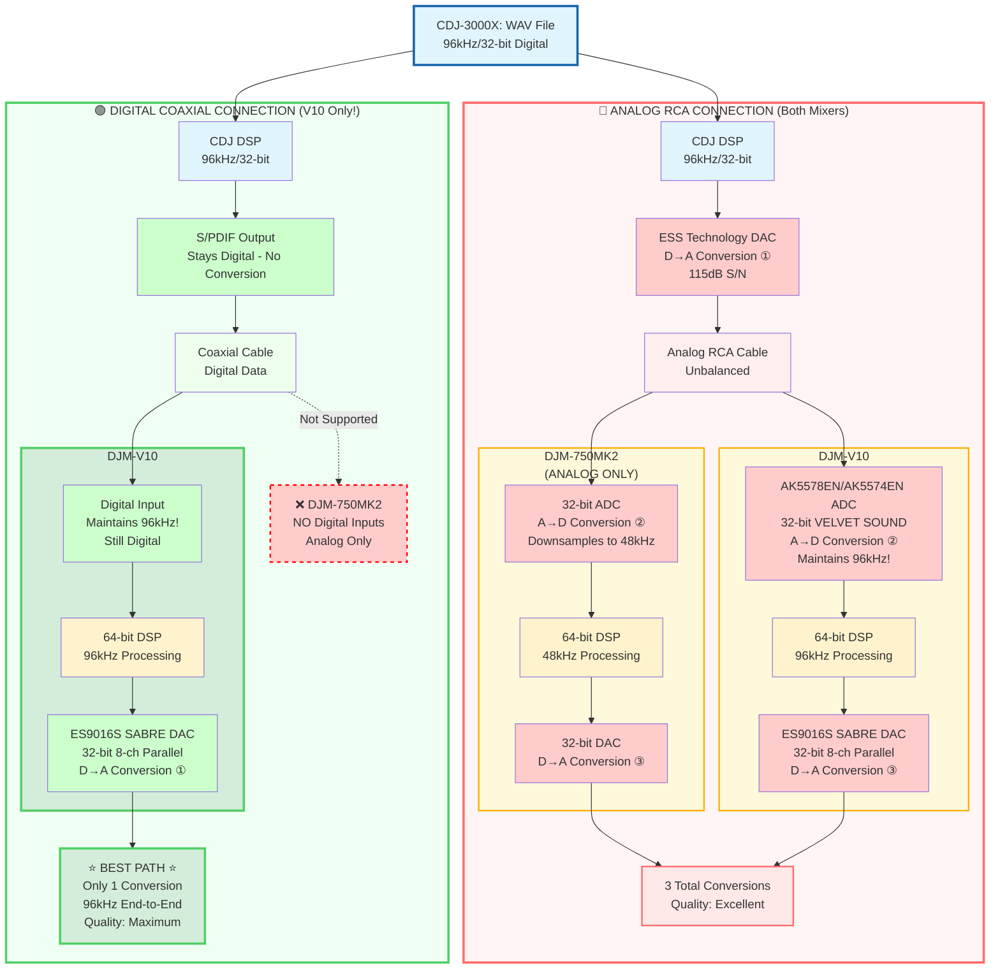

# DJ signal path

---

## Detailed Signal Chain: CDJ-3000X → DJM-750MK2 (RCA) → PA

Signal Chain: CDJ-3000X → DJM-750MK2 (RCA) → PA.

**CDJ-3000X**: AlphaTheta flagship DJ media player
- ESS Technology DAC, 115 dB S/N ratio
- 96 kHz/32-bit internal processing
- Cloud connectivity and Wi-Fi capable

**DJM-750MK2**: Pioneer DJ 4-channel performance mixer
- 32-bit ADC/DAC with 64-bit DSP
- 11 Beat FX + 4 Sound Color FX
- Send/Return loop capability
- rekordbox dj and dvs license included

### 1. CDJ-3000X Playback & Processing

- **Source**: WAV file stored on USB/SD card or streamed via cloud
- **Format Support**: Up to 24-bit/96kHz
- **Internal Processing**: 96 kHz/32-bit floating-point
- **Digital Processing**:
  - Pitch control
  - Key shift
  - Loops
  - Hot cues
  - Beat sync
  - All performance features

### 2. CDJ-3000X DAC (Digital-to-Analog Conversion)
#### **Hardware**
- **DAC Chip**: ESS Technology (high-performance model)
- **Signal-to-Noise Ratio**: 115 dB
- **Total Harmonic Distortion**: 0.0018%
- **Frequency Response**: 4 Hz – 40 kHz

#### **Power Supply**
- Newly designed power supply unit
- Reduces unwanted noise
- Enhances low-frequency power for punchy bass and warm tone

#### **Output**
- **Connection Type**: Unbalanced RCA analog outputs (rear panel)
- **Output Level**: 2.0 Vrms (1 kHz, 0 dB)
- **Signal Type**: Analog stereo audio

### 3. Cable Connection
- **Cable Type**: RCA stereo cable
- **Signal**: Unbalanced analog audio
- **Destination**: DJM-750MK2 line inputs (channel 1-4)

### 4. DJM-750MK2 Input Stage
#### **Analog-to-Digital Conversion**
- **ADC Chip**: 32-bit A/D converter
- **Purpose**: Converts incoming analog signal back to digital domain
- **Sample Rate**: 48 kHz (standard operating mode)
- **Resolution**: 32-bit

**Note**: Signal undergoes second conversion here (D→A at CDJ, then A→D at mixer)

### 5. DJM-750MK2 DSP Processing
#### **Digital Signal Processor**
- **DSP Type**: 64-bit digital signal processor
- **Dithering**: Applied for optimal bit-depth conversion
- **Processing Power**: Handles all mixing and effects in real-time

#### **Signal Path Through Mixer**
1. **Channel Strip Processing**:
   - TRIM control (input gain)
   - 3-band EQ (HIGH/MID/LOW)
     - Standard mode: +6dB to -26dB
     - Isolator mode: Total kill capability
   - Sound Color FX (if applied to channel)
   - Channel fader

2. **Master Bus Processing**:
   - Crossfader blending
   - Master level control
   - **Beat FX on Master** (when effects are applied to master output):
     - 11 Beat FX available (Delay, Echo, Ping Pong, Spiral, Reverb, Transform, Flanger, Pitch, Roll, Vinyl Brake, Helix)
     - FX Frequency control (isolate which frequencies are affected)
     - Beat multiplier/division
     - Level/depth control

### 6. DJM-750MK2 Output Stage
#### **Digital-to-Analog Conversion**
- **DAC Chip**: 32-bit D/A converter
- **Sample Rate**: 48 kHz
- **Resolution**: 32-bit
- **Processing**: Dithering applied for optimal conversion

#### **Master Output**
- **Connection Type**: Unbalanced RCA outputs (Master 2)
- **Alternative**: Balanced XLR outputs (Master 1) - but you specified RCA
- **Signal Type**: Analog stereo audio
- **Master Attenuator**: -12/-6/0 dB switch (factory default: 0 dB)

### 7. PA Connection
- **Cable Type**: RCA stereo cable
- **Destination**: PA system/powered speakers/amplifier inputs
- **Signal**: Final analog audio output with all processing applied

### Technical Summary (DJM-750MK2)

#### Conversion Count
- **Total conversions in chain**: 3
  1. D→A: CDJ-3000X ESS DAC
  2. A→D: DJM-750MK2 32-bit ADC
  3. D→A: DJM-750MK2 32-bit DAC

#### Signal Quality Specifications
| Stage | Bit Depth | Sample Rate | S/N Ratio | THD |
|-------|-----------|-------------|-----------|-----|
| CDJ-3000X Processing | 32-bit float | 96 kHz | - | - |
| CDJ-3000X DAC Output | - | - | 115 dB | 0.0018% |
| DJM-750MK2 ADC | 32-bit | 48 kHz | - | - |
| DJM-750MK2 DSP | 64-bit | 48 kHz | - | - |
| DJM-750MK2 DAC | 32-bit | 48 kHz | - | - |
| DJM-750MK2 Master Out | - | - | 105 dB | - |

#### Key Points About DJM-750MK2 Setup

1. **Using RCA Analog Connections**: The signal goes through additional D/A and A/D conversions compared to using digital coaxial connections between CDJ and mixer. This adds minimal latency but maintains compatibility with all input types.

2. **Master Effects Processing**: Your effects are applied in the 64-bit DSP after all channel mixing, meaning they affect the entire stereo mix before final D/A conversion.

3. **ESS DAC Advantage**: The CDJ-3000X's upgraded ESS DAC provides improved clarity in highs and punchier bass compared to the CDJ-3000, though differences are most noticeable on high-quality sound systems.

4. **Sample Rate Change**: Audio is processed at 96 kHz in the CDJ but reduced to 48 kHz in the mixer's DSP. This is standard for DJ mixers and maintains excellent audio quality.

5. **Unbalanced vs Balanced**: Your RCA connections are unbalanced, which can be more susceptible to noise over long cable runs compared to balanced XLR connections.

---

## Detailed Signal Chain: CDJ-3000X → DJM-V10 (RCA) → PA

Signal Chain: CDJ-3000X → DJM-V10 (RCA) → PA

**CDJ-3000X**: AlphaTheta flagship DJ media player
- ESS Technology DAC, 115 dB S/N ratio
- 96 kHz/32-bit internal processing
- Cloud connectivity and Wi-Fi capable

**DJM-V10**: Pioneer DJ 6-channel creative mixer
- 32-bit Asahi Kasei ADC with VELVET SOUND (AK5578EN/AK5574EN)
- 32-bit ESS SABRE 8-channel DAC (ES9016S) in parallel configuration
- 64-bit DSP at 96 kHz
- 4-band EQ per channel with custom curves
- 3-band master isolator
- Per-channel compression
- Extensive send/return section (4 built-in + 2 external)
- EA2 mechanical relays for pristine signal switching
- rekordbox dj and dvs compatible

### 1. CDJ-3000X Playback & Processing
- **Source**: WAV file stored on USB/SD card or streamed via cloud
- **Format Support**: Up to 24-bit/96kHz
- **Internal Processing**: 96 kHz/32-bit floating-point
- **Digital Processing**:
  - Pitch control
  - Key shift
  - Loops
  - Hot cues
  - Beat sync
  - All performance features

### 2. CDJ-3000X DAC (Digital-to-Analog Conversion)
#### **Hardware**
- **DAC Chip**: ESS Technology (high-performance model)
- **Signal-to-Noise Ratio**: 115 dB
- **Total Harmonic Distortion**: 0.0018%
- **Frequency Response**: 4 Hz – 40 kHz

#### **Power Supply**
- Newly designed power supply unit
- Reduces unwanted noise
- Enhances low-frequency power for punchy bass and warm tone

#### **Output**
- **Connection Type**: Unbalanced RCA analog outputs (rear panel)
- **Output Level**: 2.0 Vrms (1 kHz, 0 dB)
- **Signal Type**: Analog stereo audio

### 3. Cable Connection
- **Cable Type**: RCA stereo cable
- **Signal**: Unbalanced analog audio
- **Destination**: DJM-V10 line inputs (channel 1-6)

### 4. DJM-V10 Input Stage
#### **Analog-to-Digital Conversion**
- **ADC Chips**:
  - **Channels 1-4**: Asahi Kasei AK5578EN (32-bit premium ADC with VELVET SOUND technology)
  - **Channels 5-6**: Asahi Kasei AK5574EN (32-bit premium ADC with VELVET SOUND technology)
- **Sample Rate**: 96 kHz
- **Resolution**: 32-bit
- **Input Circuit**: Redesigned input differential conversion circuit with optimized audio parts for rich, high-definition, low-distortion sound

#### **Input Switching**
- Line/phono input switching uses high-performance EA2 mechanical relays from EM Devices Co.
- Eliminates signal distortion from non-linear electrical components
- Completely cancels unpleasant noise in switching circuits

**Note**: Signal undergoes second conversion here (D→A at CDJ, then A→D at mixer)

### 5. DJM-V10 DSP Processing
#### **Digital Signal Processor**
- **DSP Type**: 64-bit digital signal processor
- **Sample Rate**: 96 kHz (studio-quality processing)
- **Dithering**: Applied for optimal bit-depth conversion
- **Clock Circuit**: Low-jitter clock circuit for precise timing
- **Processing Power**: Handles all mixing and effects in real-time

#### **Signal Path Through Mixer**
1. **Channel Strip Processing**:
   - TRIM control (input gain)
   - **COMPRESSOR** knob (per-channel dynamic control)
     - Adjustable ratio and threshold
     - Designed to balance vintage vinyl tracks with modern mastered music
   - **4-band EQ** (HIGH/MID-HIGH/MID-LOW/LOW)
     - Custom curves tailored to electronic music
     - HIGH and LOW bands can act as kills (total isolation)
     - Two MID-RANGE bands with custom curves
   - **FILTER** (dedicated knob with resonance control)
     - Separate High Pass and Low Pass modes
     - Full knob range dedicated to selected mode (2x resolution vs DJM-900NXS2)
   - Channel fader

2. **Master Bus Processing**:
   - Crossfader blending (if using standard DJM-V10)
   - **3-Band MASTER ISOLATOR** (HIGH/MID/LOW)
     - New boost/cut curves
     - Adjusted crossover frequencies
     - Large knobs for dramatic tone control
   - Master level control
   - **Effects on Master** (when applied to master output):
     - **Beat FX**: Delay, Echo, Ping Pong, Spiral, Helix, Reverb, Shimmer, Flanger, Phaser, Filter, Trans, Roll, Pitch, Vinyl Brake
     - **Send/Return FX**: Short Delay, Long Delay, Dub Echo, Reverb (4 built-in)
       - Size/Feedback control
       - Time control
       - Tone control
       - Master Mix Level control
     - External effects via 2x TRS send/return jacks

### 6. DJM-V10 Output Stage
#### **Digital-to-Analog Conversion**
- **DAC Chip**: ESS Technology ES9016S (32-bit SABRE 8-channel DAC)
- **Configuration**: Used for both master and booth outputs
- **Parallel Operation**: DAC output driven in parallel to further improve S/N ratio
- **Sample Rate**: Selectable (44.1 kHz, 48 kHz, 88.2 kHz, 96 kHz)
- **Resolution**: 32-bit

#### **Output Circuit Optimization**
- Honed output circuit with improved operational amplifiers
- Optimized capacitors for maximum DAC capability
- Optimal tuning for low-noise, high-resolution sound
- Easy to listen to even at high volume

#### **Output Switching**
- Master output circuit uses high-performance EA2 mechanical relays from EM Devices Co.
- Eliminates signal distortion from non-linear components
- Cancels unpleasant noise in mute circuits

#### **Master Output**
- **Connection Type**: Unbalanced RCA outputs (Master 2)
- **Alternative**: Balanced XLR outputs (Master 1) - but you specified RCA
- **Digital Output**: AES/EBU XLR (optional)
- **Signal Type**: Analog stereo audio
- **Reference Level**: Adjustable in utility settings

### 7. PA Connection
- **Cable Type**: RCA stereo cable
- **Destination**: PA system/powered speakers/amplifier inputs
- **Signal**: Final analog audio output with all processing applied

### Technical Summary (DJM-V10)

#### Conversion Count
- **Total conversions in chain**: 3
  1. D→A: CDJ-3000X ESS DAC
  2. A→D: DJM-V10 32-bit Asahi Kasei ADC (AK5578EN/AK5574EN)
  3. D→A: DJM-V10 32-bit ESS SABRE DAC (ES9016S)

#### Signal Quality Specifications
| Stage | Bit Depth | Sample Rate | S/N Ratio | THD |
|-------|-----------|-------------|-----------|-----|
| CDJ-3000X Processing | 32-bit float | 96 kHz | - | - |
| CDJ-3000X DAC Output | - | - | 115 dB | 0.0018% |
| DJM-V10 ADC (AK5578EN/AK5574EN) | 32-bit | 96 kHz | - | - |
| DJM-V10 DSP | 64-bit | 96 kHz | - | - |
| DJM-V10 DAC (ES9016S) | 32-bit | 44.1-96 kHz | - | - |
| DJM-V10 Master Out | - | - | 105 dB | 0.005% |
| DJM-V10 Frequency Response | - | - | 20 Hz - 40 kHz | - |

#### Key Points About DJM-V10 Setup

1. **Premium Audio Path**: The DJM-V10 uses top-tier converters from both ESS Technology (DAC) and Asahi Kasei (ADC), maintaining 96 kHz sample rate throughout the entire digital signal path—matching the CDJ-3000X's processing rate.

2. **Using RCA Analog Connections**: The signal goes through D/A and A/D conversions, but both devices use premium converters optimized for DJ use. The V10's redesigned input differential conversion circuit minimizes any quality loss.

3. **Master Effects Processing**: Your effects are applied in the 64-bit DSP at 96 kHz before final D/A conversion. The V10's extensive effects section includes master isolators, send/return FX, and Beat FX that all affect the master output.

4. **VELVET SOUND Technology**: The Asahi Kasei ADCs use proprietary VELVET SOUND technology designed to reduce distortion and improve clarity during the analog-to-digital conversion stage.

5. **Parallel DAC Operation**: The ES9016S is an 8-channel DAC run in parallel configuration, which improves the signal-to-noise ratio beyond what a single DAC channel could achieve.

6. **Mechanical Relays**: The V10 uses high-performance EA2 mechanical relays for input/output switching instead of electronic components, eliminating non-linear distortion and switching noise.

7. **No Sample Rate Downconversion**: Unlike the DJM-750MK2 (which operates at 48 kHz), the V10 maintains 96 kHz throughout its signal path, preserving the full resolution from the CDJ-3000X.

8. **4-Band EQ vs 3-Band**: The V10's 4-band EQ (vs standard 3-band) gives you separate control over two mid-range frequencies, with curves specifically designed for electronic music.

9. **Per-Channel Compression**: The V10's compressor on each channel helps balance tracks with different mastering levels—especially useful when mixing vintage vinyl rips with modern compressed productions.

10. **Master Isolator**: The 3-band master isolator with large knobs allows for dramatic tonal changes to your entire mix, perfect for transitions and creative mixing techniques.

---

## Comparison: DJM-V10 vs DJM-750MK2

| Feature | DJM-V10 | DJM-750MK2 |
|---------|---------|------------|
| **Channels** | 6 | 4 |
| **ADC** | 32-bit AK5578EN/AK5574EN (VELVET SOUND) | 32-bit (standard) |
| **DAC** | 32-bit ESS ES9016S (8-ch parallel) | 32-bit (standard) |
| **DSP Sample Rate** | 96 kHz | 48 kHz |
| **DSP Bit Depth** | 64-bit | 64-bit |
| **S/N Ratio** | 105 dB | 105 dB |
| **THD** | 0.005% | - |
| **Frequency Response** | 20 Hz - 40 kHz | - |
| **EQ Type** | 4-band (custom curves) | 3-band |
| **Master Isolator** | Yes (3-band) | No |
| **Per-Channel Compression** | Yes | No |
| **Filter Type** | Dedicated knob, separate HP/LP | Sound Color FX |
| **Send/Return** | 4 built-in + 2 external | 1 external |
| **Input Switching** | EA2 mechanical relays | Electronic |
| **Output Switching** | EA2 mechanical relays | Electronic |

