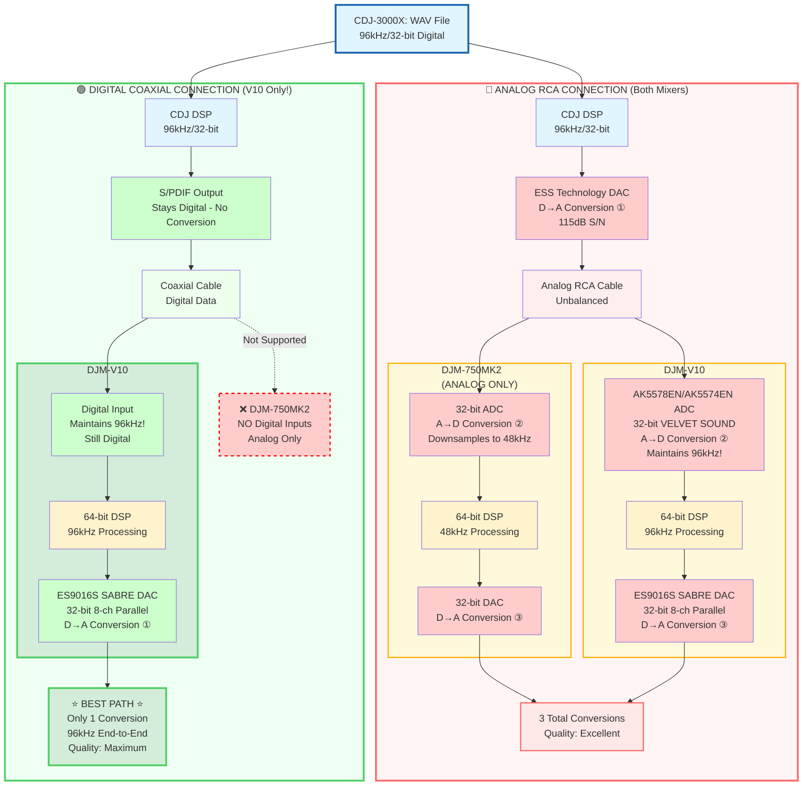

# DJ signal path

```mermaid
graph TB
    START[CDJ-3000X: WAV File<br/>96kHz/32-bit Digital]

    subgraph ANALOG ["🔴 ANALOG RCA CONNECTION (Both Mixers)"]
        A1[CDJ DSP<br/>96kHz/32-bit]
        A2[ESS Technology DAC<br/>D→A Conversion ①<br/>115dB S/N]
        A3[Analog RCA Cable<br/>Unbalanced]
        
        subgraph A_750["DJM-750MK2<br/>(ANALOG ONLY)"]
            A4[32-bit ADC<br/>A→D Conversion ②<br/>Downsamples to 48kHz]
            A5[64-bit DSP<br/>48kHz Processing]
            A6[32-bit DAC<br/>D→A Conversion ③]
        end
        
        subgraph A_V10["DJM-V10"]
            A7[AK5578EN/AK5574EN ADC<br/>32-bit VELVET SOUND<br/>A→D Conversion ②<br/>Maintains 96kHz!]
            A8[64-bit DSP<br/>96kHz Processing]
            A9[ES9016S SABRE DAC<br/>32-bit 8-ch Parallel<br/>D→A Conversion ③]
        end
        
        A_OUT[3 Total Conversions<br/>Quality: Excellent]
    end

    subgraph DIGITAL ["🟢 DIGITAL COAXIAL CONNECTION (V10 Only!)"]
        D1[CDJ DSP<br/>96kHz/32-bit]
        D2[S/PDIF Output<br/>Stays Digital - No Conversion]
        D3[Coaxial Cable<br/>Digital Data]
        
        subgraph D_V10["DJM-V10"]
            D7[Digital Input<br/>Maintains 96kHz!<br/>Still Digital]
            D8[64-bit DSP<br/>96kHz Processing]
            D9[ES9016S SABRE DAC<br/>32-bit 8-ch Parallel<br/>D→A Conversion ①]
        end
        
        D_OUT["⭐ BEST PATH ⭐<br/>Only 1 Conversion<br/>96kHz End-to-End<br/>Quality: Maximum"]
        
        NO_750["❌ DJM-750MK2<br/>NO Digital Inputs<br/>Analog Only"]
    end

    START --> A1
    START --> D1
    
    A1 --> A2
    A2 --> A3
    A3 --> A4
    A3 --> A7
    A4 --> A5 --> A6
    A7 --> A8 --> A9
    A6 --> A_OUT
    A9 --> A_OUT
    
    D1 --> D2
    D2 --> D3
    D3 --> D7
    D3 -.->|Not Supported| NO_750
    D7 --> D8 --> D9
    D9 --> D_OUT

    style START fill:#e1f5ff,stroke:#1864ab,stroke-width:3px
    
    style A1 fill:#e1f5ff
    style A2 fill:#ffcccc
    style A3 fill:#ffeeee
    style A4 fill:#ffcccc
    style A5 fill:#fff3cd
    style A6 fill:#ffcccc
    style A7 fill:#ffcccc
    style A8 fill:#fff3cd
    style A9 fill:#ffcccc
    style A_OUT fill:#ffe8e8,stroke:#ff6b6b,stroke-width:2px
    
    style D1 fill:#e1f5ff
    style D2 fill:#ccffcc
    style D3 fill:#eeffee
    style D7 fill:#ccffcc
    style D8 fill:#fff3cd
    style D9 fill:#ccffcc
    style D_OUT fill:#d4edda,stroke:#51cf66,stroke-width:3px
    style NO_750 fill:#ffcccc,stroke:#ff0000,stroke-width:2px,stroke-dasharray: 5 5
    
    style ANALOG fill:#fff5f5,stroke:#ff6b6b,stroke-width:3px
    style DIGITAL fill:#f0fff4,stroke:#51cf66,stroke-width:3px
    style A_750 fill:#fff9db,stroke:#fab005,stroke-width:2px
    style A_V10 fill:#fff9db,stroke:#fab005,stroke-width:2px
    style D_V10 fill:#d4edda,stroke:#51cf66,stroke-width:3px
```

